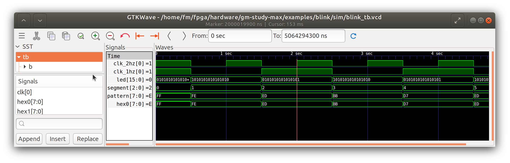
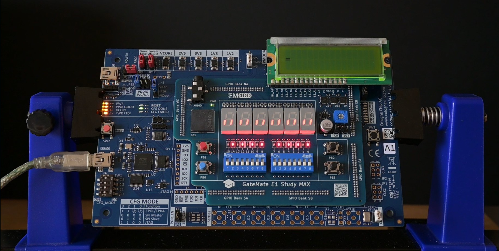

## GM-STUDY-MAX Example "blink"

This Verilog example program validates the function of the ten LED0..9. Using a clock divider for the 10MHz system clock, it alternates between LED0,2,4,6,8,10,12,14 and LED1,3,5,7,9,11,13,15 with a frequency of 2Hz. Additionally, it cycles through the individual segments of the 7-Segment modules.

### Usage

Synthesis, routining and bitstream upload is done through the Gatemate-provided opensource toolchain (here it is runing under Ubuntu Linux).

```
fm@nuc7vm2204:~/fpga/hardware/gm-study-max/examples/blink$ make all
/home/fm/cc-toolchain-linux/bin/yosys/yosys -ql log/synth.log -p 'read -sv src/blink.v; synth_gatemate -top blink -vlog net/blink_synth.v'
/home/fm/cc-toolchain-linux/bin/p_r/p_r -i net/blink_synth.v -o blink -ccf ../gm-study-e1.ccf > log/impl.log
/usr/local/bin/openFPGALoader  -b gatemate_evb_jtag blink_00.cfg
Jtag frequency : requested 6.00MHz   -> real 6.00MHz
Load SRAM via JTAG: [==================================================] 100.00%
Done
Wait for CFG_DONE DONE
```

### Simulation

The iverilog testbench file blink_tb.v is available in the 'sim' folder.



### Example Picture



