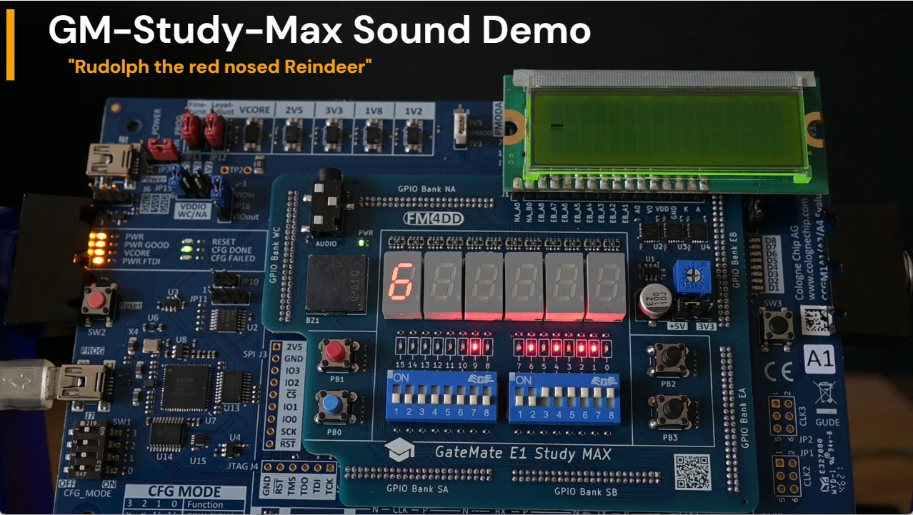

## GM-STUDY-MAX Example "sound"

This Verilog example program validates the function of the buzzer sound module by playing a melody. A press of push button PB0 starts or stops the song. The note values are displayed as binary on the LEDs, and with their value on the 7-Segment digits 4/5. The song played is "Rudolph the red nosed reindeer", with the source code adapted from https://www.fpga4fun.com/MusicBox4.html.


### Usage

```
fm@nuc7vm2204:~/fpga/hardware/gm-study-max/examples/sound$ make all
/home/fm/cc-toolchain-linux/bin/yosys/yosys -ql log/synth.log -p 'read -sv src/debounce.v src/hexdigit.v src/sound.v; synth_gatemate -top sound -nomx8 -vlog net/sound_synth.v'
/home/fm/cc-toolchain-linux/bin/p_r/p_r -i net/sound_synth.v -o sound -ccf ../gm-study-max.ccf > log/impl.log
/usr/local/bin/openFPGALoader  -b gatemate_evb_jtag sound_00.cfg
Jtag frequency : requested 6.00MHz   -> real 6.00MHz
Load SRAM via JTAG: [==================================================] 100.00%
Done
Wait for CFG_DONE DONE
```

### Example

<a href="https://youtu.be/5feP9MUxmBE">
Click to play on Youtube



