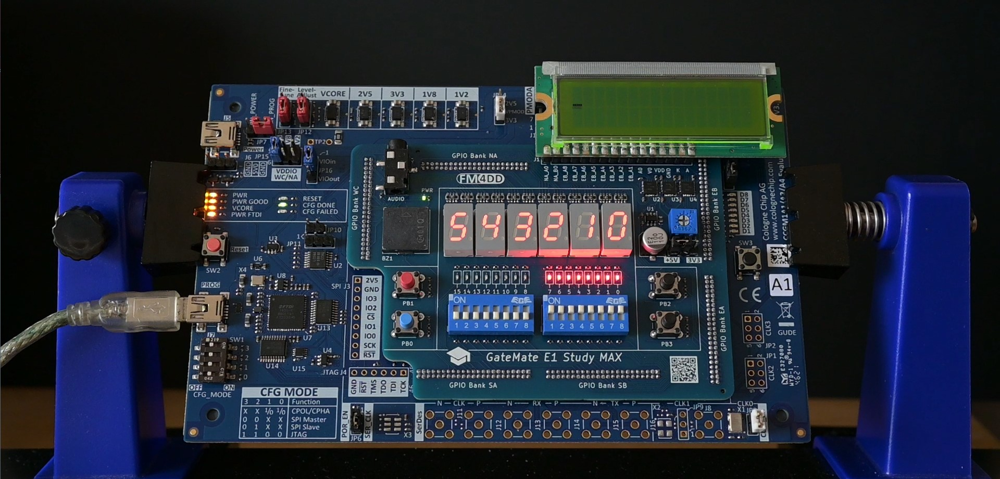

## GM-STUDY-MAX Example "switch"

This Verilog example program validates the function of the sixteen DIP switches. This program works without a clock. Turning a DIP switch "on" enables the respective board LED0..15. For switches SW0..5, turning it on also lights up the respective 7-segment module with its number.

### Usage

```
fm@nuc7vm2204:~/fpga/hardware/gm-study-max/examples/switch$ make all
/home/fm/cc-toolchain-linux/bin/yosys/yosys -ql log/synth.log -p 'read -sv src/hexdigit.v src/switch.v; synth_gatemate -top switch -nomx8 -vlog net/switch_synth.v'
/home/fm/cc-toolchain-linux/bin/p_r/p_r -i net/switch_synth.v -o switch -ccf ../gm-study-max.ccf > log/impl.log
/usr/local/bin/openFPGALoader  -b gatemate_evb_jtag switch_00.cfg
Jtag frequency : requested 6.00MHz   -> real 6.00MHz
Load SRAM via JTAG: [==================================================] 100.00%
Done
Wait for CFG_DONE DONE
```

### Example


