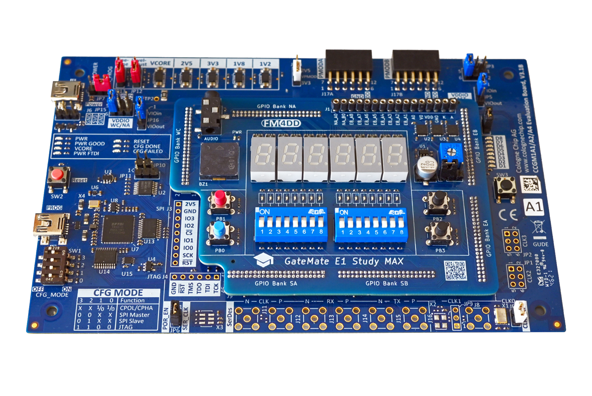

## GM-STUDY-MAX

### Description

The gm-study-max board is an application module board for the <a href="https://www.colognechip.com/programmable-logic/gatemate-evaluation-board/">GateMate FPGA evaluation board E1</a>, made by <a href="https://www.colognechip.com/">Cologne Chip</a>. It connects to the evaluation board through all six GPIO headers, and the input/output components are designed after popular FPGA trainer boards commonly used in electrical engineering and embedded systems education (e.g. Digilent Basys or Altera DE10-lite). The MAX board is the successor to the earlier <a href="https://github.com/fm4dd/gm-study-e1">gm-study-e1</a> and <a href="https://github.com/fm4dd/gm-proto-e1">gm-proto-e1</a> boards.

The board earns the "MAX" naming by utilising *all* 98 GPIO pins available on the six expansion headers of the GateMate E1 board.

### Overview

The gm-study-max boards provide:
- 4x push buttons
- 16x DIP slide switches
- 16x LED
- 6x 7-Segment display modules (non-multiplexed)
- 1x 4 Khz buzzer
- 1x 3.5mm Stereo Audio jack
- J1 11-pin 2.54mm pitch header with 3.3 or 5V signal translation

The J1 pin header and pinout can connect 5V HD44780 character LCD display modules, or interface with breadboards for prototyping. Depending on jumper JP1, the FPGA 2.5V IO signals are translated into either 3.3V or 5V TTL signal levels, which can be used with a wide range of microcontrollers, including Arduino.

### Hardware Versions

| Version | Gerber | Schema |
|---------|--------|--------|
| 1.0     |[20230320-gm-study-e1-max-gerber.zip](fabfiles/v10/20230320-gm-study-e1-max-gerber.zip) | [20230320-kicad-max-schema.pdf](fabfiles/v10/20230320-kicad-max-schema.pdf) |

 
 

### Pin Assignments

[Pin Assignment](pin-assignment.md)
[Hardware Constraints File (CCF)](examples/gm-study-max.ccf)

### Example Code

The following Verilog code examples demonstrate the board input/output components for quick verification. The code has been tested with the pre-compiled opensource toolchain released through the GateMate support site at <a href="https://www.colognechip.com/mygatemate/">https://www.colognechip.com/mygatemate/</a>

| Language | Folder                     | Description                                                          |
|----------|----------------------------|----------------------------------------------------------------------|
| Verilog  |[blink](examples/blink)     | blinks sixteen LED's in a alternating pattern                        |
| Verilog  |[count](examples/count)     | counter for 1 byte, binary on 8xLED, hex/dec on six 7-Segment digits |
| Verilog  |[button](examples/button)   | push button press changes LED frequency and light move direction     |
| Verilog  |[switch](examples/switch)   | each slide switch turns its corresponding LED on or off              |
| Verilog  |[sound](examples/sound)     | play a song on the buzzer, show notes on LED and 7-segment digits    |
| Verilog  |[wavplay](examples/wavplay) | play a wav file over the 3.5mm audio jack                            |
| Verilog  |[display](examples/display) | display "Hello World!" on a character LCD connected via header J1    |

### Board Pictures

The gm-study-max application board, running the display demo.

The gm-study-max application board has been designed with KiCad version 7.0.

The gm-study-max application board demo video: https://www.youtube.com/watch?v=GMx3H4D8pCE

5V signal translation check through the Analog Discovery 2 oscilloscope, measured from the J1 header pins

Sound example, playing a melody on the onboard buzzer https://youtu.be/5feP9MUxmBE

### Training Lessons

This board is a trainer board suitable for education in digital logic design. Therefore I created a set of sample  lessons on the common subject of binary calculations. [Training Overview](training/)

| Language | Folder                     | Description                                                          |
|----------|----------------------------|----------------------------------------------------------------------|
| Verilog  |[Lesson 1](training/adder1) | introduces the implementation of a 1-bit Half Adder.                 |
| Verilog  |[Lesson 2](training/adder2) | uses the Half-Adder from Lesson-1 to build the 1-bit Full-Adder.     |
| Verilog  |[Lesson 3](training/adder3) | uses the Full-Adder design to build the 8-bit Ripple-Carry Adder     |
| Verilog  |[Lesson 4](training/adder4) | converts the Ripple-Carry Adder into an 8-bit Carry-Lookahead Adder  |