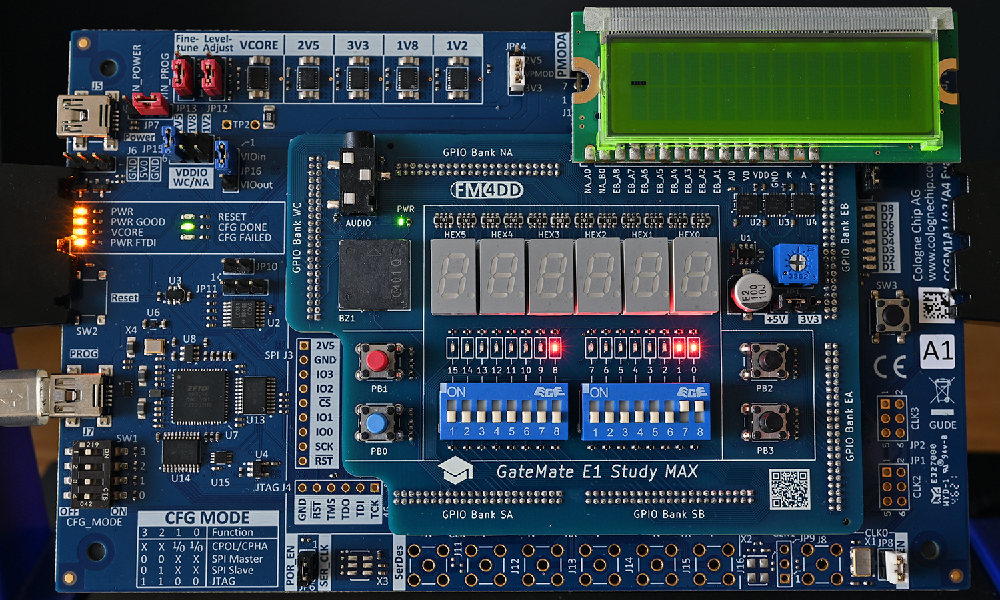

# GM-STUDY-MAX Training

## Digital Logic 01: 1-bit Half Adder

### Introduction

The central part of any computer is the CPU, and at the core of the CPU is the arithmetic logic unit (ALU). Inside the ALU, the adder circuit is the most fundamental building block. If we can add, we will also be able to subtract by adding a complement, or multiply by adding x times in a row. This puts adder logic are at the beginning of many computer science and FPGA tutorials. In this example, we introduce the Half Adder, which becomes the building block for Full Adders in following examples.


### HalfAdder Design Description

A Half Adder is a logic circuit that binary adds two 1-bit input signals ‘A’ and ‘B’. This generates the corresponding ‘C’ (CARRY) and ‘S’ (SUM) output signals. To achieve the logic for generating the correct binary ‘add’ result, we can use one AND gate, and one X-OR gate. The logical arrangement of the gates can be drawn as follows:


### Truth Table

This table represents all possible outputs obtained from the inputs of a Half Adder:
Input A | Input B | Output C (CARRY) | Output S (SUM)
--------|---------|------------------|----------------
0	    |0	      |0	             |0
0       |1	      |0	             |1
1	    |0	      |0	             |1
1	    |1	      |1	             |0
### Logic Expression

Sum   (S) = A ⊕ B
Carry (C) = A * B

### Input/Output Assignment:

Below drawing shows the signal assignment to the hardware components of the GM-STUDY-MAX trainer board:


we will use the two slide switches 0/1 as input A/B, and output the half-adder results C/S to LED 8/9. The input signals A/B are additionally shown on LED 0/1 for simple verification of the truth table.

### Verilog Code

First we create the half-adder logic in a separate module, saved to half_adder.v:

```
// -------------------------------------------------------
// half_adder.v  gm-study-max training     @20230401 fm4dd
//
// Description:
// ------------
// This module implements a half-adder. The input signals
// ‘A’ and ‘B’ generate the outputs 'S' and 'C' through
// AND and XOR gates.
// -------------------------------------------------------
module half_adder(
  input wire A,
  input wire B,
  output wire C,
  output wire S
);

  // -------------------------------------------------------
  // use XOR gate to binary add A and B into SUM S
  // -------------------------------------------------------
  xor(S, A, B);

  // -------------------------------------------------------
  // use AND gate to create output CARRY C
  // -------------------------------------------------------
  and(C, A, B);
endmodule
```
Finally we create the top module, which connects the half-adder logic to our trainer board hardware:
```
// -------------------------------------------------------
// adder1.v  gm-study-max training         @20230401 fm4dd
//
// Description:
// ------------
// This program implements a half-adder. The input signals
// are generated with slide switch stswi[0] as signal ‘A’,
// and stswi[1] as signal ‘B’. The input signals are shown
// on the correlating LEDs stled[0] and stled[1], with the
// output signal ‘C’ shown on stled[8] and ‘S’ on stled[9]
//
// Requires: 4x signal leds, 2x DIP switches
// -------------------------------------------------------
module adder1(
  input wire [1:0] stswi,
  output wire [15:0] stled
);

  // -------------------------------------------------------
  // set unused LED's to 'off', assign input switches to led
  // -------------------------------------------------------
  assign {stled[7:2], stled[15:10]} = {12{1'b0}};
  assign stled[0] = stswi[0];
  assign stled[1] = stswi[1];

  // -------------------------------------------------------
  // create half-adder, feed input switches into A and B
  // -------------------------------------------------------
  half_adder ha(stswi[0], stswi[1], stled[8], stled[9]);
endmodule
```
### Synthesis, Place&Route, Bitstream Upload

```
fm@nuc7vm2204:~/fpga/hardware/gm-study-max/training/adder1$ make all
/home/fm/cc-toolchain-linux/bin/yosys/yosys -ql log/synth.log -p 'read -sv src/adder1.v src/half_adder.v; synth_gatemate -top adder1 -nomx8 -vlog net/adder1_synth.v'
/home/fm/cc-toolchain-linux/bin/p_r/p_r -i net/adder1_synth.v -o adder1 -ccf ../gm-study-max.ccf > log/impl.log
/usr/local/bin/openFPGALoader  -b gatemate_evb_jtag adder1_00.cfg
Jtag frequency : requested 6.00MHz   -> real 6.00MHz
Load SRAM via JTAG: [==================================================] 100.00%
Done
Wait for CFG_DONE DONE
```
### Board Run

Below shows the halfadder program on the FPGA board, validating the truth table for input A/B both set to '1':



### References

Sarah L. Harris, David Money Harris - Digital Design and Computer Architecture
Chapter 5, Digital Building Blocks - page 240
ISBN: 978-0-12-800056-4