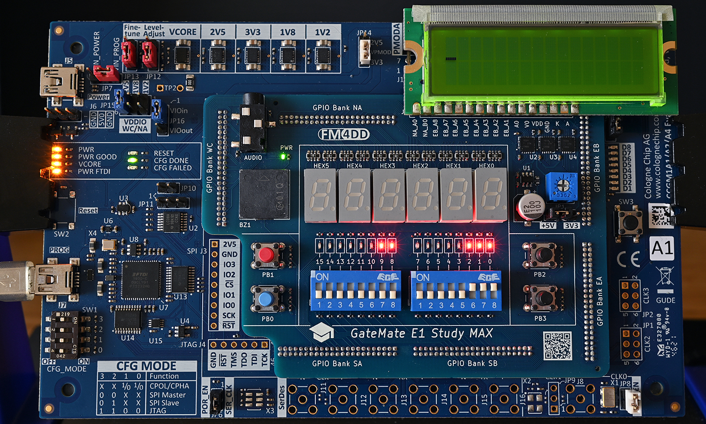

# GM-STUDY-MAX Training

## Digital Logic 02: 1-bit Full Adder

### Introduction

The Half Adder in the previous section is used to add only two 1-bit binary numbers, and its sum only ranges from 0 to 2. Here we transform it into a Full Adder by adding one more input signal, implementing 3-bit additions. The third signal is called CARRY IN, and this name becomes obvious later when we sequence several Full Adders to process a wider bit range.


### Full Adder Design Description

A Full Adder is built from two Half Adder circuits, plus an OR gate. The 1st Half Adder has two inputs, A and B, and its output signal SUM becomes one input to the 2nd Half Adder. The other input to the 2nd Half Adder will be the CARRY IN input. The CARRY outputs of both Half Adders become input to the final OR gate, which generates the final CARRY signal CARRY OUT. The logical arrangement of the gates can be drawn as follows:


### Truth Table

This table represents all possible outputs obtained from the inputs of a Full Adder:
Input A | Input B | Input Cin (Carry in) | Output Cout (Carry Out) | Output S (Sum)
--------|---------|----------------------|-------------------------|---------------
0	    |0	      |0	                 |0                        |0
0	    |1	      |0	                 |0                        |1
1	    |0	      |0	                 |0                        |1
1	    |1	      |0	                 |1                        |0
0	    |0	      |1	                 |0                        |1
0	    |1	      |1	                 |1                        |0
1	    |0	      |1	                 |1                        |0
1	    |1	      |1	                 |1                        |1

### Logic Expression

S = A ⊕ B ⊕ Cin
Cout = AB + ACin + BCin

### Input/Output Assignment:

Below drawing shows the signal assignment to the hardware components of the GM-STUDY-MAX trainer board:


we will use the two slide switches 0/1 as input A/B, and output the half-adder results C/S to LED 8/9. The input signals A/B are additionally shown on LED 0/1 for simple verification of the truth table.

### Verilog Code

First, we re-use the half_adder.v module we created in the previous section:
```
// -------------------------------------------------------
// half_adder.v  gm-study-max training     @20230401 fm4dd
//
// Description:
// ------------
// This module implements a half-adder. The input signals
// ‘A’ and ‘B’ generate the outputs 'S' and 'C' through
// AND and XOR gates.
// -------------------------------------------------------
module half_adder(
  input wire A,
  input wire B,
  output wire C,
  output wire S
);

  // -------------------------------------------------------
  // use XOR gate to binary add A and B into SUM S
  // -------------------------------------------------------
  xor(S, A, B);

  // -------------------------------------------------------
  // use AND gate to create output CARRY C
  // -------------------------------------------------------
  and(C, A, B);

endmodule
```
Next, we create the logic module for the full-adder in full_adder.v:
```
// -------------------------------------------------------
// full_adder.v  gm-study-max training     @20230401 fm4dd
//
// Description:
// ------------
// This module implements a full-adder. The input signals
// ‘A’ and ‘B’ feed into the 1st half-adder, while Cin and
// S_ha1 feed into the 2nd half-adder. The final Cout gets
// created through an OR gate of both C_ha1 and C_ha2.
// -------------------------------------------------------
module full_adder(
  input wire A,
  input wire B,
  input wire Cin,
  output wire Cout,
  output wire S
);

  wire C_ha1, S_ha1, C_ha2;

  // -------------------------------------------------------
  // 1st half adder generates interim output C_ha1, S_ha1
  // -------------------------------------------------------
  half_adder ha1(A, B, C_ha1, S_ha1);

  // -------------------------------------------------------
  // 2nd half adder generates S, and C_ha2
  // -------------------------------------------------------
  half_adder ha2(S_ha1, Cin, C_ha2, S);

  // -------------------------------------------------------
  // Finally the OR gate generates Cout from C_ha1 and C_ha2
  // -------------------------------------------------------
  or(Cout, C_ha1, C_ha2);
endmodule
```
Finally we create the top-level module to connect the full-adder to our trainer board hardware:
```
// -------------------------------------------------------
// adder2.v  gm-study-max training         @20230401 fm4dd
//
// Description:
// ------------
// This program implements a fulladder. The input signals
// are generated with slide switch stswi[0] as signal ‘A’,
// stswi[1] as signal ‘B’, and stswi[2] as 'Cin'. The input
// signals are shown on the correlating LEDs stled[0..2].
// The output signals ‘Cout’ is shown on stled[8], and 'S'
// is shown on stled[9].
//
// Requires: 5x signal leds, 3x DIP switches
// -------------------------------------------------------
module adder2(
  input wire [2:0] stswi,
  output wire [15:0] stled
);

  // -------------------------------------------------------
  // set unused LED's to 'off', assign input switches to led
  // -------------------------------------------------------
  assign {stled[7:3], stled[15:10]} = {12{1'b0}};
  assign stled[0] = stswi[0];
  assign stled[1] = stswi[1];
  assign stled[2] = stswi[2];

  // -------------------------------------------------------
  // create fulladder, feed input switches to A, B and Cin
  // -------------------------------------------------------
  full_adder fa1(stswi[0], stswi[1], stswi[2], stled[8], stled[9]);
endmodule
```

### Synthesis, Place&Route, Bitstream Upload

```
fm@nuc7vm2204:~/fpga/hardware/gm-study-max/training/adder2$ make all
/home/fm/cc-toolchain-linux/bin/yosys/yosys -ql log/synth.log -p 'read -sv src/adder2.v src/full_adder.v src/half_adder.v; synth_gatemate -top adder2 -nomx8 -vlog net/adder2_synth.v'
/home/fm/cc-toolchain-linux/bin/p_r/p_r -i net/adder2_synth.v -o adder2 -ccf ../gm-study-max.ccf > log/impl.log
/usr/local/bin/openFPGALoader  -b gatemate_evb_jtag adder2_00.cfg
Jtag frequency : requested 6.00MHz   -> real 6.00MHz
Load SRAM via JTAG: [==================================================] 100.00%
Done
Wait for CFG_DONE DONE
```
### Board Run

Below shows the fulladder program on the FPGA board, validating the truth table for input A/B/Cin, all set to '1':



### References

Sarah L. Harris, David Money Harris - Digital Design and Computer Architecture
Chapter 5, Digital Building Blocks - page 240
ISBN: 978-0-12-800056-4