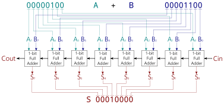
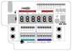
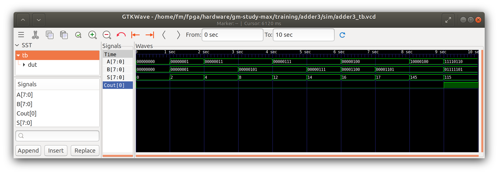

# GM-STUDY-MAX Training

## Digital Logic 03: 8-bit Ripple-Carry Adder

### Introduction

In this section we extend our previous logic to design N-bit adders. In our code, we built an 8-bit Adder, covering a range from 0..255.


### Design Description

The simplest way of designing an N-bit adder is to chain the 1-bit Full Adder logic, with the CARRY OUT of the previous bit becomes the CARRY IN signal of the following bit. This type of N-bit adder is called the Ripple-Carry Adder. The logical arrangement with a sample calculation can be drawn as follows:



The example above calculates 4 + 12 = 16 (hex: 10)

### Input/Output Assignment:

Below drawing shows the signal assignment to the hardware components of the GM-STUDY-MAX trainer board:



We will use the left DIP switch module 8..15 as input A, and the right DIP switch module 0..7 as input B. The output sum S will be displayed in hex on 7-Segment digits HEX0 and HEX1, and in decimal on 7-Segment digits HEX3, HEX4 and HEX5. The input signal Cin is fixed to '0', and the output Signal Cout is ignored.

### Verilog Code

First, we re-use the half_adder.v module we created in the previous section:
```
// -------------------------------------------------------
// half_adder.v  gm-study-max training     @20230401 fm4dd
//
// Description:
// ------------
// This module implements a half-adder. The input signals
// ‘A’ and ‘B’ generate the outputs 'S' and 'C' through
// AND and XOR gates.
// -------------------------------------------------------
module half_adder(
  input wire A,
  input wire B,
  output wire C,
  output wire S
);

  // -------------------------------------------------------
  // use XOR gate to binary add A and B into SUM S
  // -------------------------------------------------------
  xor(S, A, B);

  // -------------------------------------------------------
  // use AND gate to create output CARRY C
  // -------------------------------------------------------
  and(C, A, B);
endmodule
```
Next, we reuse the logic module in full_adder.v:
```
// -------------------------------------------------------
// full_adder.v  gm-study-max training     @20230401 fm4dd
//
// Description:
// ------------
// This module implements a full-adder. The input signals
// ‘A’ and ‘B’ feed into the 1st half-adder, while Cin and
// S_ha1 feed into the 2nd half-adder. The final Cout gets
// created through an OR gate of both C_ha1 and C_ha2.
// -------------------------------------------------------
module full_adder(
  input wire A,
  input wire B,
  input wire Cin,
  output wire Cout,
  output wire S
);

  wire C_ha1, S_ha1, C_ha2;

  // -------------------------------------------------------
  // 1st half adder generates interim output C_ha1, S_ha1
  // -------------------------------------------------------
  half_adder ha1(A, B, C_ha1, S_ha1);

  // -------------------------------------------------------
  // 2nd half adder generates S, and C_ha2
  // -------------------------------------------------------
  half_adder ha2(S_ha1, Cin, C_ha2, S);

  // -------------------------------------------------------
  // Finally the OR gate generates Cout from C_ha1 and C_ha2
  // -------------------------------------------------------
  or(Cout, C_ha1, C_ha2);
endmodule
```
Now we create the 8-bit ripple-carry adder module in file rc_adder8.v
```
// -------------------------------------------------------
// rc_adder8.v  gm-study-max training     @20230401 fm4dd
//
// Description:
// ------------
// This module implements an 8-bit ripple-carry adder. The
// input signals ‘A’ and ‘B’ bits are chained through 8x
// 1-bit fulladders.
// -------------------------------------------------------
module rc_adder8(
  input wire [7:0] A,
  input wire [7:0] B,
  input wire Cin,
  output wire Cout,
  output wire [7:0] S
);

  // -------------------------------------------------------
  // create C_faX carry signals to chain between fulladders
  // -------------------------------------------------------
  wire C_fa1, C_fa2, C_fa3, C_fa4, C_fa5, C_fa6, C_fa7;

  // -------------------------------------------------------
  // create fulladder 1-8, feed input bits to A, B & chain C
  // -------------------------------------------------------
  full_adder fa1(A[0], B[0], Cin,   C_fa1, S[0]);
  full_adder fa2(A[1], B[1], C_fa1, C_fa2, S[1]);
  full_adder fa3(A[2], B[2], C_fa2, C_fa3, S[2]);
  full_adder fa4(A[3], B[3], C_fa3, C_fa4, S[3]);
  full_adder fa5(A[4], B[4], C_fa4, C_fa5, S[4]);
  full_adder fa6(A[5], B[5], C_fa5, C_fa6, S[5]);
  full_adder fa7(A[6], B[6], C_fa6, C_fa7, S[6]);
  full_adder fa8(A[7], B[7], C_fa7, Cout,  S[7]);
endmodule
```
Not mentioned, but copied in are two modules that drive the 7-Segment display: hexdigit.v and binbcd.v. These modules encode the 8-bit Sum data as hex and decimal (BCD) for easy reading.

Finally we create the top-level module to connect the carry-ripple adder to our trainer board hardware:
```
// -------------------------------------------------------
// adder3.v  gm-study-max training         @20230409 fm4dd
//
// Description:
// ------------
// This program implements an 8 bit ripple-carry adder. The
// input signals are generated by slide switch stswi[15:8]
// as signal ‘A’, and stswi[7:0] as signal ‘B’. 'Cin' is
// set to '0'. The input signals are also visible on the
// correlating LEDs stled[15:0]. The output signal 'S' is
// is shown in hex on 7-segment digits sthex1 and sthex2,
// and in decimal on 3 digits sthex3, sthex4 and sthex5.
//
// Requires: 16x LEDs, 16x switches, 5x 7-Segment digits
// -------------------------------------------------------
module adder3(
  input wire [15:0] stswi,
  output wire [15:0] stled,
  output wire [7:0] sthex0,
  output wire [7:0] sthex1,
  output wire [7:0] sthex3,
  output wire [7:0] sthex4,
  output wire [7:0] sthex5
);

  wire Cin, Cout;
  wire [7:0] S;
  wire [4:0] digit_0;
  wire [4:0] digit_1;
  wire [4:0] digit_2;
  wire [4:0] digit_3;
  wire [4:0] digit_4;
  wire [4:0] digit_5;

  // -------------------------------------------------------
  // assign input switches to led
  // -------------------------------------------------------
  assign stled[15:0] = stswi[15:0];
  assign Cin = 1'b0;

  // -------------------------------------------------------
  // Module rc adder8: feed input switches to A, B, set Cin
  // -------------------------------------------------------
  rc_adder8 rca8(stswi[15:8], stswi[7:0], Cin, Cout, S);

  reg [11:0] bcd;
  bin2bcd dec (S, bcd);
  // -------------------------------------------------------
  // Module hexdigit: Creates the LED pattern from 3 args:
  // in:  4bit input 0-15 displays the hex value from 0..F
  // dp:  0 or 1, disables/enables the decimal point led
  // out: bit pattern result driving the 7seg module leds
  // -------------------------------------------------------
  hexdigit h0 (digit_0, 1'b0, sthex0);
  hexdigit h1 (digit_1, 1'b0, sthex1);
  hexdigit h3 (digit_3, 1'b0, sthex3);
  hexdigit h4 (digit_4, 1'b0, sthex4);
  hexdigit h5 (digit_5, 1'b0, sthex5);

  assign digit_0 = S[3:0];
  assign digit_1 = S[7:4];
  assign digit_3 = bcd[3:0];  // decimal 1's
  assign digit_4 = bcd[7:4];  // decimal 10's
  assign digit_5 = bcd[11:8]; // decimmal 100's
endmodule
```

### Synthesis, Place&Route, Bitstream Upload

```
fm@nuc7vm2204:~/fpga/hardware/gm-study-max/training/adder3$ make all
/home/fm/cc-toolchain-linux/bin/yosys/yosys -ql log/synth.log -p 'read -sv src/adder3.v src/binbcd.v src/full_adder.v
src/half_adder.v src/hexdigit.v src/rc_adder8.v; synth_gatemate -top adder3 -nomx8 -vlog net/adder3_synth.v'
/home/fm/cc-toolchain-linux/bin/p_r/p_r -i net/adder3_synth.v -o adder3 -ccf ../gm-study-max.ccf > log/impl.log
/usr/local/bin/openFPGALoader  -b gatemate_evb_jtag adder3_00.cfg
Jtag frequency : requested 6.00MHz   -> real 6.00MHz
Load SRAM via JTAG: [==================================================] 100.00%
Done
Wait for CFG_DONE DONE
```
### Board Run

Below shows the program uploaded to the FPGA board, validating the example addition of 8(A) + 12(B) = 16dec/10hex (S):


### iVerilog Simulation

Here we simulate the rc_adder8 module logic with a set of example calculations in a test bench:
```
m@nuc7vm2204:~/fpga/hardware/gm-study-max/training/adder3$ make synth_sim
iverilog -Winfloop -g2012 -gspecify -Ttyp -o sim/synth_sim.vvp net/adder3_synth.v sim/adder3_tb.v
/home/fm/cc-toolchain-linux/bin/yosys/share/gatemate/cells_sim.v
vvp -N sim/synth_sim.vvp -lx2
LXT2 info: dumpfile sim/adder3_tb.vcd opened for output.

A-bits (8) + B-bits (8) = S-bits (8) (dec) Cout: b
----------------------------------------------------
A-00000000 + B-00000000 = S-00000000 (  0) Cout: 0
A-00000001 + B-00000001 = S-00000010 (  2) Cout: 0
A-00000011 + B-00000001 = S-00000100 (  4) Cout: 0
A-00000011 + B-00000101 = S-00001000 (  8) Cout: 0
A-00000111 + B-00000101 = S-00001100 ( 12) Cout: 0
A-00000111 + B-00000111 = S-00001110 ( 14) Cout: 0
A-00000100 + B-00001100 = S-00010000 ( 16) Cout: 0
A-00000100 + B-00001101 = S-00010001 ( 17) Cout: 0
A-10000100 + B-00001101 = S-10010001 (145) Cout: 0
A-11110110 + B-01111101 = S-01110011 (115) Cout: 1
```

Here is the simulation shown in GTKWave:



### References

Sarah L. Harris, David Money Harris - Digital Design and Computer Architecture
Chapter 5, Digital Building Blocks - page 240
ISBN: 978-0-12-800056-4