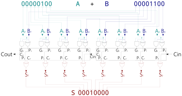
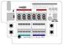
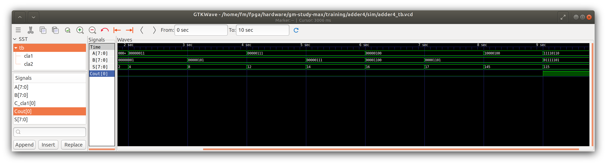

# GM-STUDY-MAX Training

## Digital Logic 04: 8-bit Carry-Lookahead Adder

### Introduction

The Ripple-Carry Adder from the previous section is very easy to build, but has the disadvantage of the CARRY signal required to traverse each 1-bit full-Adder in sequence. This delay grows with the number of bits, and make calculations slow to execute. To improve the CARRY signal propagation, the Carry-Lookahead Adder will be introduced in this section.


### Design Description

To explain the idea of Carry-Lookahead, lets return to the 1-bit full-adder truth table from section 02, and add a column describing the Carry type:

Input A | Input B | Input Cin (Carry in) | Output Cout (Carry Out) | Output S (Sum)| Carry Type
--------|---------|----------------------|-------------------------|---------------|--------------
0	    |0	      |0	                 |0                        |0              |No Carry
0	    |1	      |0	                 |0                        |1              |No Carry
1	    |0	      |0	                 |0                        |1              |No Carry
1	    |1	      |0	                 |1                        |0              |Generate
0	    |0	      |1	                 |0                        |1              |No Carry
0	    |1	      |1	                 |1                        |0              |Propagate
1	    |0	      |1	                 |1                        |0              |Propagate
1	    |1	      |1	                 |1                        |1              |Generate/Propagate

We can see two CARRY conditions: it is either generated (as part of the addition result), or propagated (if the CARRY IN bit was set). We introduce two new variables, Carry Generate (G) and Carry Propagate (P):




The picure above shows the logic design of the 8-bit adder, built from two 4-bit carry-lookahead adder modules. The input example calculates 4 + 12 = 16 (hex: 10)

### Input/Output Assignment:

Below drawing shows the signal assignment to the hardware components of the GM-STUDY-MAX trainer board:



We will use the exact same hardware assignment as in our previous lesson. The left DIP switch module 8..15 as input A, and the right DIP switch module 0..7 as input B. The output sum S will be displayed in hex on 7-Segment digits HEX0 and HEX1, and in decimal on 7-Segment digits HEX3, HEX4 and HEX5. The input signal Cin is fixed to '0', and the output Signal Cout is ignored.

### Verilog Code

First, we create a 4-bit carry-lookahead adder module in file cl_adder4.v:
```
// -------------------------------------------------------
// cl_adder4.v  gm-study-max training     @20230401 fm4dd
//
// Description:
// ------------
// This module implements an 4-bit carry-lookahead adder.
// -------------------------------------------------------

module cl_adder4(
  input wire [3:0] A,
  input wire [3:0] B,
  input wire Cin,
  output wire Cout,
  output wire [3:0] S
);

  // -------------------------------------------------------
  // 1st level: Create propagate, generate and intermediate
  // carry signals
  // -------------------------------------------------------
  wire [3:0] P;  /* Carry Propagate */
  wire [3:0] G;  /* Carry Generate */
  wire [4:0] C;  /* Intermediate Carry */
  assign P = A ^ B; // Create Propagate whenever A=1 or B=1
  assign G = A & B; // Create Generate whenever A=1 & B=1

  // -------------------------------------------------------
  // 2nd level: Create carry signals (C0, C1, C2, and C4)
  // -------------------------------------------------------
  assign C[0] = Cin;
  assign C[1] = G[0] | (P[0] & Cin);
  assign C[2] = G[1] | (P[1] & G[0]) | (P[1] & P[0] & Cin);
  assign C[3] = G[2] | (P[2] & G[1]) | (P[2] & P[1] & G[0]) | (P[2] & P[1] & P[0] & Cin);
  assign C[4] = G[3] | (P[3] & G[2]) | (P[3] & P[2] & G[1]) |
            (P[3] & P[2] & P[1] & G[0]) | (P[3] & P[2] & P[1] & P[0] & Cin);

  // -------------------------------------------------------
  // 3rd level: Create four SUM signals (S[0..3], and Cout
  // -------------------------------------------------------
  assign S = P ^ C[3:0];
  assign Cout = C[4];
endmodule
```
Not mentioned, but copied in are two modules that drive the 7-Segment display: hexdigit.v and binbcd.v. These modules encode the 8-bit Sum data as hex and decimal (BCD) for easy reading.

Finally we create the top-level module to create the 8-bit carry-lookahead adder from two 4-bit modules, and connect the input/output signals to our trainer board hardware:
```
// -------------------------------------------------------
// adder4.v  gm-study-max training         @20230409 fm4dd
//
// Description:
// ------------
// This program implements an 8-bit carry-lookahead adder,
// from 2x 4-bit carry-lookahead modules chained together.
// Input signals are generated by slide switch stswi[15:8]
// as signal ‘A’, and stswi[7:0] as signal ‘B’. 'Cin' is
// set to '0'. The input signals are also visible on the
// correlating LEDs stled[15:0]. The output signal 'S' is
// is shown in hex on 7-segment digits sthex1 and sthex2,
// and in decimal on 3 digits sthex3, sthex4 and sthex5.
//
// Requires: 16x LEDs, 16x switches, 5x 7-Segment digits
// -------------------------------------------------------
module adder4(
  input wire [15:0] stswi,
  output wire [15:0] stled,
  output wire [7:0] sthex0,
  output wire [7:0] sthex1,
  output wire [7:0] sthex3,
  output wire [7:0] sthex4,
  output wire [7:0] sthex5
);

  wire Cin, Cout;
  wire [7:0] S;
  wire [4:0] digit_0;
  wire [4:0] digit_1;
  wire [4:0] digit_2;
  wire [4:0] digit_3;
  wire [4:0] digit_4;
  wire [4:0] digit_5;

  // -------------------------------------------------------
  // assign input switches to led
  // -------------------------------------------------------
  assign stled[15:0] = stswi[15:0];
  assign Cin = 1'b0;

  // -------------------------------------------------------
  // Module cl_adder4: feed input switches to A, B, set Cin
  // Because the CLA logic uses 4-bit, we need two modules
  // -------------------------------------------------------
  wire C_cla1;
  cl_adder4 cla1(stswi[11:8], stswi[3:0], Cin, C_cla1, S[3:0]);
  cl_adder4 cla2(stswi[15:12], stswi[7:4], C_cla1, Cout, S[7:4]);

  reg [11:0] bcd;
  bin2bcd dec (S, bcd);
  // -------------------------------------------------------
  // Module hexdigit: Creates the LED pattern from 3 args:
  // in:  4bit input 0-15 displays the hex value from 0..F
  // dp:  0 or 1, disables/enables the decimal point led
  // out: bit pattern result driving the 7seg module leds
  // -------------------------------------------------------
  hexdigit h0 (digit_0, 1'b0, sthex0);
  hexdigit h1 (digit_1, 1'b0, sthex1);
  hexdigit h3 (digit_3, 1'b0, sthex3);
  hexdigit h4 (digit_4, 1'b0, sthex4);
  hexdigit h5 (digit_5, 1'b0, sthex5);

  assign digit_0 = S[3:0];
  assign digit_1 = S[7:4];
  assign digit_3 = bcd[3:0];  // decimal 1's
  assign digit_4 = bcd[7:4];  // decimal 10's
  assign digit_5 = bcd[11:8]; // decimmal 100's
endmodule
```

### Synthesis, Place&Route, Bitstream Upload

```
fm@nuc7vm2204:~/fpga/hardware/gm-study-max/training/adder4$ make all
/home/fm/cc-toolchain-linux/bin/yosys/yosys -ql log/synth.log -p 'read -sv src/adder4.v src/binbcd.v src/cl_adder4.v src/hexdigit.v; synth_gatemate -top adder4 -nomx8 -vlog net/adder4_synth.v'
/home/fm/cc-toolchain-linux/bin/p_r/p_r -i net/adder4_synth.v -o adder4 -ccf ../gm-study-max.ccf > log/impl.log
/usr/local/bin/openFPGALoader  -b gatemate_evb_jtag adder4_00.cfg
Jtag frequency : requested 6.00MHz   -> real 6.00MHz
Load SRAM via JTAG: [==================================================] 100.00%
Done
Wait for CFG_DONE DONE
```
### Board Run

Below shows the program uploaded to the the FPGA board, validating the example addition of 8(A) + 12(B) = 16dec/10hex (S):


### iVerilog Simulation

Here we simulate the cl_adder4 module logic with a set of example calculations in a test bench:
```
fm@nuc7vm2204:~/fpga/hardware/gm-study-max/training/adder4$ make synth_sim
iverilog -Winfloop -g2012 -gspecify -Ttyp -o sim/synth_sim.vvp net/adder4_synth.v sim/adder4_tb.v /home/fm/cc-toolchain-linux/bin/yosys/share/gatemate/cells_sim.v
vvp -N sim/synth_sim.vvp -lx2
LXT2 info: dumpfile sim/adder4_tb.vcd opened for output.

A-bits (8) + B-bits (8) = S-bits (8) (dec) Cout: b
----------------------------------------------------
A-00000000 + B-00000000 = S-00000000 (  0) Cout: 0
A-00000001 + B-00000001 = S-00000010 (  2) Cout: 0
A-00000011 + B-00000001 = S-00000100 (  4) Cout: 0
A-00000011 + B-00000101 = S-00001000 (  8) Cout: 0
A-00000111 + B-00000101 = S-00001100 ( 12) Cout: 0
A-00000111 + B-00000111 = S-00001110 ( 14) Cout: 0
A-00000100 + B-00001100 = S-00010000 ( 16) Cout: 0
A-00000100 + B-00001101 = S-00010001 ( 17) Cout: 0
A-10000100 + B-00001101 = S-10010001 (145) Cout: 0
A-11110110 + B-01111101 = S-01110011 (115) Cout: 1
```

Here is the simulation shown in GTKWave:



### References

Sarah L. Harris, David Money Harris - Digital Design and Computer Architecture
Chapter 5, Digital Building Blocks - page 240
ISBN: 978-0-12-800056-4