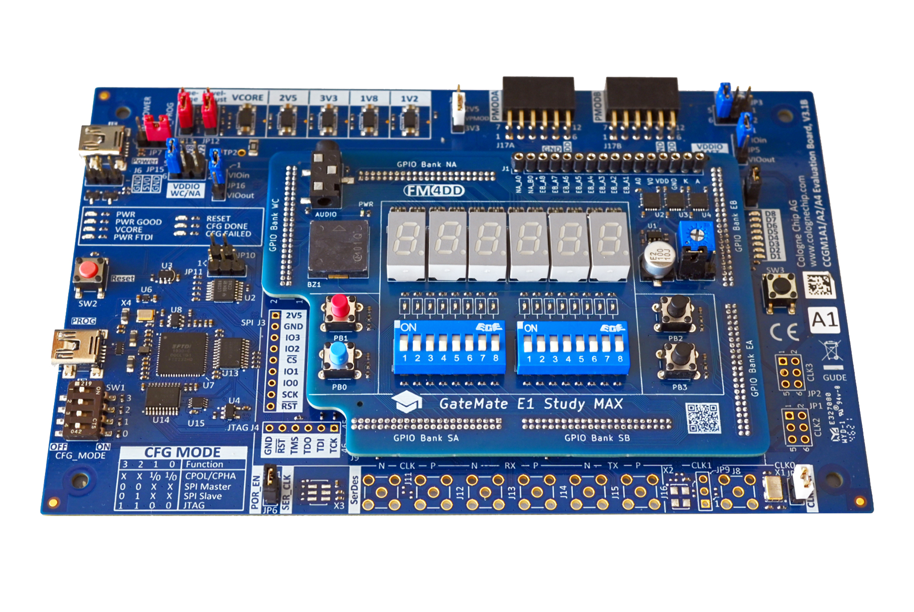
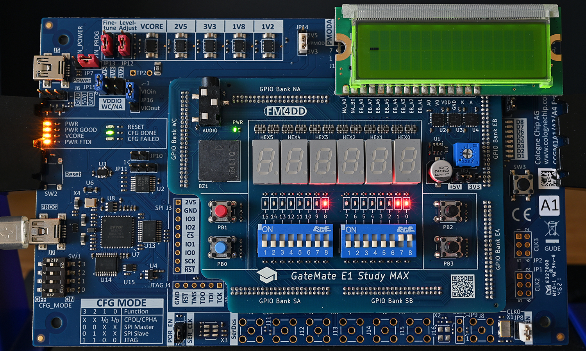
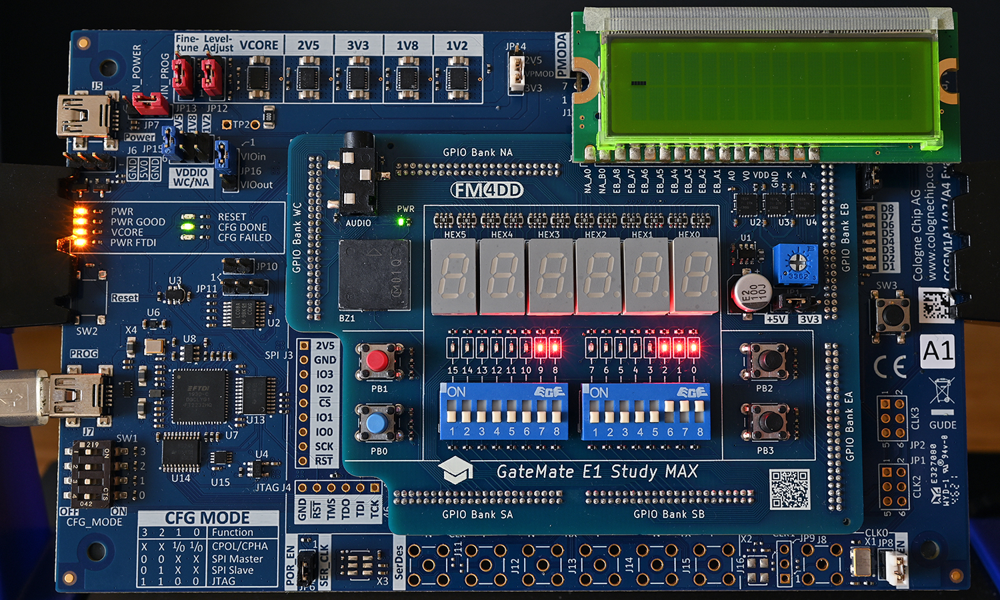
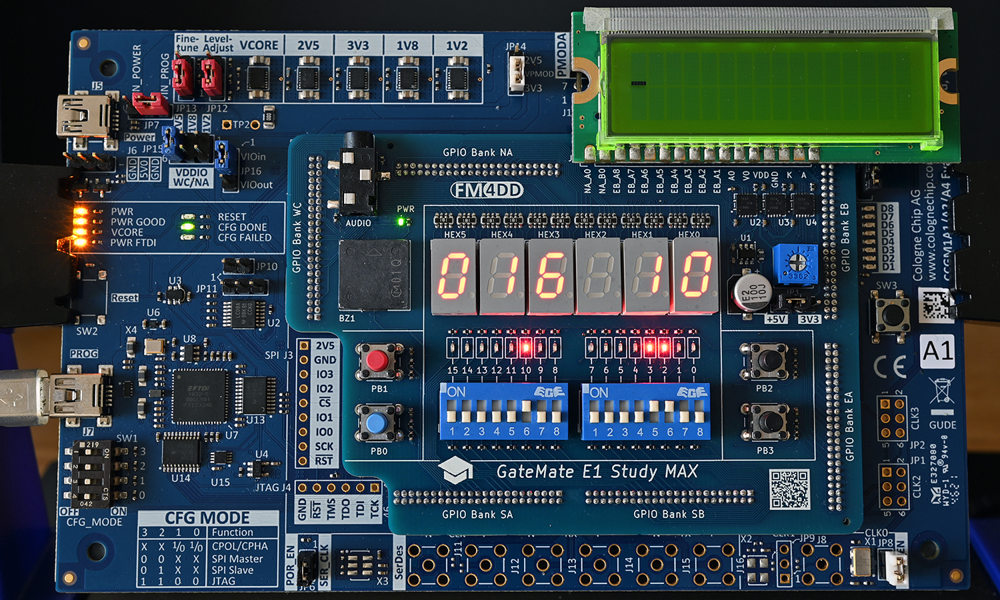

## Lessons in Digital Logic

### Introduction

The gm-study-max board is designed after popular FPGA trainer boards commonly used in electrical engineering and embedded systems education. Here I created a set of sample lessons on the common subject of binary calculations.

### Digital Logic Design - Binary Calculations

| Language | Folder                     | Description                                                       |                                             |
|----------|----------------------------|-------------------------------------------------------------------|---------------------------------------------|
| Verilog  |[Lesson 1](training/adder1) | introduces the implementation of a 1-bit Half Adder.              ||
| Verilog  |[Lesson 2](training/adder2) | uses the Half-Adder from Lesson-1 to build the 1-bit Full-Adder   ||
| Verilog  |[Lesson 3](training/adder3) | uses the Full-Adder design to build the 8-bit Ripple-Carry Adder  ||
| Verilog  |[Lesson 4](training/adder4) | switch the Ripple-Carry Adder into an 8-bit Carry-Lookahead Adder ||
