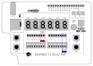

# GM-STUDY-MAX Training

## Digital Logic 05: 1-bit Half-Substractor

### Introduction

Very similar to our 1-bit Half-Adder/Full-Ader designs from section 01 and 02, we create the equivalent for 1-bit substractions.


### Design Description

A Half Subtractor is a logic circuit that binary subtracts a 1-bit input signal ‘B’ (Subtrahend bit) from input signal ‘A’ (Minuend bit). This generates the corresponding ‘D’ (DIFFERENCE) and ‘Bout’ (BORROW) output signals. To achieve the logic for generating the correct binary ‘subtract’ result, we can use one XOR gate, and a AND gate with signal A routed through a NOT gate. The logical arrangement of the gates can be drawn as follows:


### Truth Table

This table represents all possible outputs obtained from the inputs of a Half Subtractor:
Input A | Input B | Output Bout | Output D
--------|---------|-------------|----------
0	    |0	      |0	        |0
0       |1	      |1	        |1
1	    |0	      |0	        |1
1	    |1	      |0	        |0

### Logic Expression

Difference  (D) = A ⊕ B
Borrow (Bout) = (NOT (A)) . B.

### Input/Output Assignment:

Below drawing shows the signal assignment to the hardware components of the GM-STUDY-MAX trainer board:



We will use the two slide switches 0/1 as input A/B, and output the half-subtractor results Bout/D to LED 8/9. The input signals A/B are additionally shown on LED 0/1 for simple verification of the truth table.

### Verilog Code

First, we create a 1-bit half-substractor module in file half-substract.v:
```
// -------------------------------------------------------
// half_subtract.v  gm-study-max training  @20230411 fm4dd
//
// Description:
// ------------
// This module implements a half-subtractor. Input signals
// ‘A’ and ‘B’ generate the outputs 'D' and 'Bout' through
// AND and XOR gates.
// -------------------------------------------------------
module half_subtract(
  input wire A,
  input wire B,
  output wire Bout,
  output wire D
);

  // -------------------------------------------------------
  // use XOR gate to binary substract B from A into Diff D
  // -------------------------------------------------------
  xor(D, A, B);
  // -------------------------------------------------------
  // use AND gate to create output Bout, feed A as negated
  // -------------------------------------------------------
  and(Bout, ~A, B);
endmodule
```
Finally we create the top module, which connects the half-substract logic to our trainer board hardware:
```
// -------------------------------------------------------
// substract1.v  gm-study-max training     @20230401 fm4dd
//
// Description:
// ------------
// This program implements a half-substractor. Input signals
// are generated with slide switch stswi[0] as signal ‘A’,
// and stswi[1] as signal ‘B’. The input signals are shown
// on the correlating LEDs stled[0] and stled[1], with the
// output signal ‘D’ shown on stled[8], ‘Bout’ on stled[9].
//
// Requires: 4x signal leds, 2x DIP switches
// -------------------------------------------------------
module substract1(
  input wire [1:0] stswi,
  output wire [15:0] stled
);

  // -------------------------------------------------------
  // set unused LED's to 'off', assign input switches to led
  // -------------------------------------------------------
  assign {stled[7:2], stled[15:10]} = {12{1'b0}};
  assign stled[0] = stswi[0];
  assign stled[1] = stswi[1];

  // -------------------------------------------------------
  // create half-substract, feed input switches into A and B
  // -------------------------------------------------------
  half_substract ha(stswi[0], stswi[1], stled[8], stled[9]);
endmodule
```

### Synthesis, Place&Route, Bitstream Upload

```
fm@nuc7vm2204:~/fpga/hardware/gm-study-max/training/subtract1$ make all
/home/fm/cc-toolchain-linux/bin/yosys/yosys -ql log/synth.log -p 'read -sv src/half_subtract.v src/subtract1.v; synth_gatemate -top subtract1 -nomx8 -vlog net/subtract1_synth.v'
/home/fm/cc-toolchain-linux/bin/p_r/p_r -i net/subtract1_synth.v -o subtract1 -ccf ../gm-study-max.ccf > log/impl.log
/usr/local/bin/openFPGALoader  -b gatemate_evb_jtag subtract1_00.cfg
Jtag frequency : requested 6.00MHz   -> real 6.00MHz
Load SRAM via JTAG: [==================================================] 100.00%
Done
Wait for CFG_DONE DONE
```
### Board Run

Below shows the program uploaded to the the FPGA board:


### iVerilog Simulation

Here we simulate the half-subtract module logic, showing the truth table result a test bench:
```
fm@nuc7vm2204:~/fpga/hardware/gm-study-max/training/subtract1$ make synth_sim
iverilog -Winfloop -g2012 -gspecify -Ttyp -o sim/synth_sim.vvp net/subtract1_synth.v sim/subtract1_tb.v /home/fm/cc-toolchain-linux/bin/yosys/share/gatemate/cells_sim.v
vvp -N sim/synth_sim.vvp -lx2
LXT2 info: dumpfile sim/half_subtract_tb.vcd opened for output.

A-bit - B-bit = Bout: b / D: d
--------------------------------
A-x - B-x = Bout-x / D-x
A-0 - B-0 = Bout-0 / D-0
A-1 - B-0 = Bout-0 / D-1
A-0 - B-1 = Bout-1 / D-1
A-1 - B-1 = Bout-0 / D-0
```

### References

Sarah L. Harris, David Money Harris - Digital Design and Computer Architecture
Chapter 5, Section 5.2.2 Digital Building Blocks - page 246
ISBN: 978-0-12-800056-4