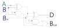
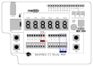
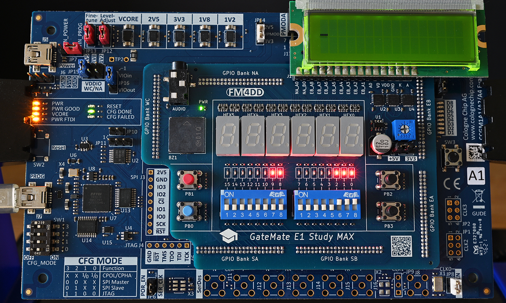

# GM-STUDY-MAX Training

## Digital Logic 06: 1-bit Full-Substractor

### Introduction

Very similar to our 1-bit Full-Subtractor design from the previous section, we create the equivalent for 1-bit substractions by adding the additional Bin (Borrow) signal for 3-bit substraction, combining two half-subtractors.


### Design Description

A Full Subtractor is a logic circuit that binary subtracts a 1-bit input signal ‘B’ (Subtrahend bit) from input signal ‘A’ (Minuend bit), while observing an additional Bin (BORROW IN) signal. It generates the corresponding ‘D’ (DIFFERENCE) and ‘Bout’ (BORROW) output signals. To achieve the logic, we combine two half-subtractors and a final OR gate follows:



### Truth Table

This table represents all possible outputs obtained from the inputs of a Full Subtractor:
Input A | Input B | Input Bin | Output Bout | Output D
--------|---------|-----------|-------------|---------
0	    |0	      |0	      |0            |0
0	    |1	      |0	      |0            |1
1	    |0	      |0	      |0            |1
1	    |1	      |0	      |1            |0
0	    |0	      |1	      |0            |1
0	    |1	      |1	      |1            |0
1	    |0	      |1	      |1            |0
1	    |1	      |1	      |1            |1

### Logic Expression

Difference  (D) = A ⊕ B
Borrow (Bout) = (NOT (A)) . B.

### Input/Output Assignment:

Below drawing shows the signal assignment to the hardware components of the GM-STUDY-MAX trainer board:



We will use the three slide switches 0/1/2 as input A/B/Bin, and output the full-subtractor results Bout/D to LED 8/9. The input signals A/B are additionally shown on LED 0/1 for simple verification of the truth table.

### Verilog Code

First, we create a 1-bit half-substractor module in file half-substract.v:
```
// -------------------------------------------------------
// half_subtract.v  gm-study-max training  @20230411 fm4dd
//
// Description:
// ------------
// This module implements a half-subtractor. Input signals
// ‘A’ and ‘B’ generate the outputs 'D' and 'Bout' through
// AND and XOR gates.
// -------------------------------------------------------

module half_subtract(
  input wire A,
  input wire B,
  output wire Bout,
  output wire D
);

  // -------------------------------------------------------
  // use XOR gate to binary substract B from A into Diff D
  // -------------------------------------------------------
  xor(D, A, B);

  // -------------------------------------------------------
  // use AND gate to create output Bout, feed A as negated
  // -------------------------------------------------------
  and(Bout, ~A, B);
endmodule
```
Next, we create the logic module for the full-subtractor in full_subtract.v:
```
// -------------------------------------------------------
// full_subtract.v  gm-study-max training  @20230411 fm4dd
//
// Description:
// ------------
// This module implements a full-subtractor. Input signals
// ‘A’ and ‘B’ generate the outputs 'D' and 'Bout' through
// the logic implemented in half_subtract.v.
// -------------------------------------------------------
module full_subtract(
  input wire A,
  input wire B,
  input wire Bin,
  output wire Bout,
  output wire D
);

  wire B_hs1, D_hs1, B_hs2;

  // -------------------------------------------------------
  // 1st half subtract generates interim output B_hs1, D_hs1
  // -------------------------------------------------------
  half_subtract hs1(A, B, B_hs1, D_hs1);

  // -------------------------------------------------------
  // 2nd half subtract generates D, and B_hs2
  // -------------------------------------------------------
  half_subtract hs2(D_hs1, Bin, B_hs2, D);

  // -------------------------------------------------------
  // Finally the OR gate generates Bout from B_hs1 and C_hs2
  // -------------------------------------------------------
  or(Bout, B_hs1, B_hs2);
endmodule
```
Here we create the top-level module to connect the full-substract logic to our trainer board hardware:
```
// -------------------------------------------------------
// substract2.v  gm-study-max training     @20230401 fm4dd
//
// Description:
// ------------
// This program implements a full-subtractor. Input signals
// are generated with slide switch stswi[0] as signal ‘A’,
// and stswi[1] as signal ‘B’. The input signals are shown
// on the correlating LEDs stled[0] and stled[1], with the
// output signal ‘D’ shown on stled[8], ‘Bout’ on stled[9].
//
// Requires: 4x signal leds, 2x DIP switches
// -------------------------------------------------------

module subtract2(
  input wire [2:0] stswi,
  output wire [15:0] stled
);

  // -------------------------------------------------------
  // set unused LED's to 'off', assign input switches to led
  // -------------------------------------------------------
  assign {stled[7:3], stled[15:10]} = {12{1'b0}};
  assign stled[0] = stswi[0];
  assign stled[1] = stswi[1];
  assign stled[2] = stswi[2];

  // -------------------------------------------------------
  // create full-substractor with switch inputs to A, B, Bin
  // -------------------------------------------------------
  full_subtract fs(stswi[0], stswi[1], stswi[2], stled[8], stled[9]);
endmodule
```

### Synthesis, Place&Route, Bitstream Upload

```
fm@nuc7vm2204:~/fpga/hardware/gm-study-max/training/subtract2$ make all
/home/fm/cc-toolchain-linux/bin/yosys/yosys -ql log/synth.log -p 'read -sv src/full_subtract.v src/half_subtract.v src/subtract2.v; synth_gatemate -top subtract2 -nomx8 -vlog net/subtract2_synth.v'
/home/fm/cc-toolchain-linux/bin/p_r/p_r -i net/subtract2_synth.v -o subtract2 -ccf ../gm-study-max.ccf > log/impl.log
/usr/local/bin/openFPGALoader  -b gatemate_evb_jtag subtract2_00.cfg
Jtag frequency : requested 6.00MHz   -> real 6.00MHz
Load SRAM via JTAG: [==================================================] 100.00%
Done
Wait for CFG_DONE DONE
```
### Board Run

Below shows the program uploaded to the the FPGA board:



### iVerilog Simulation

Here we simulate the full-subtractor module logic, showing the truth table result a test bench:
```
fm@nuc7vm2204:~/fpga/hardware/gm-study-max/training/subtract2$ make synth_sim
iverilog -Winfloop -g2012 -gspecify -Ttyp -o sim/synth_sim.vvp net/subtract2_synth.v sim/subtract2_tb.v /home/fm/cc-toolchain-linux/bin/yosys/share/gatemate/cells_sim.v
vvp -N sim/synth_sim.vvp -lx2
LXT2 info: dumpfile sim/full_subtract_tb.vcd opened for output.

A-bit - B-bit = Bout: b / D: d
--------------------------------
A-x - B-x, Bin-x = Bout-x / D-x
A-0 - B-0, Bin-0 = Bout-0 / D-0
A-0 - B-1, Bin-0 = Bout-1 / D-1
A-1 - B-0, Bin-0 = Bout-0 / D-1
A-1 - B-1, Bin-0 = Bout-0 / D-0
A-0 - B-0, Bin-1 = Bout-1 / D-1
A-0 - B-1, Bin-1 = Bout-1 / D-0
A-1 - B-0, Bin-1 = Bout-0 / D-0
A-1 - B-1, Bin-1 = Bout-1 / D-1
```

### References

Sarah L. Harris, David Money Harris - Digital Design and Computer Architecture
Chapter 5, Section 5.2.2 Digital Building Blocks - page 246
ISBN: 978-0-12-800056-4