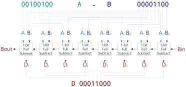

# GM-STUDY-MAX Training

## Digital Logic 07: 8-bit Ripple-Borrow Subtractor

### Introduction

In this section we extend our previous full-subtractor logic to design the 8-bit subtractor.


### Design Description

Similar to the 8-bit Ripple-Carry Addder we can build a Ripple-Borrow Subtractor. Here the BORROW OUT of the previous bit becomes the BORROW IN signal of the following bit. The logical arrangement with a sample calculation can be drawn as follows:



The example above calculates 36 - 12 = 24 (hex: 18)

### Input/Output Assignment:

Below drawing shows the signal assignment to the hardware components of the GM-STUDY-MAX trainer board:


We will use the left DIP switch module 8..15 as input A, and the right DIP switch module 0..7 as input B. The output difference D will be displayed in hex on 7-Segment digits HEX0 and HEX1, and in decimal on 7-Segment digits HEX3, HEX4 and HEX5. The input signal Bin is fixed to '0', and the output Signal Bout is ignored.

### Verilog Code

First, we re-use the half_subtract.v module we created in the previous section:
```
// -------------------------------------------------------
// half_subtract.v  gm-study-max training  @20230411 fm4dd
//
// Description:
// ------------
// This module implements a half-subtractor. Input signals
// ‘A’ and ‘B’ generate the outputs 'D' and 'Bout' through
// AND and XOR gates.
// -------------------------------------------------------
module half_subtract(
  input wire A,
  input wire B,
  output wire Bout,
  output wire D
);

  // -------------------------------------------------------
  // use XOR gate to binary substract B from A into Diff D
  // -------------------------------------------------------
  xor(D, A, B);

  // -------------------------------------------------------
  // use AND gate to create output Bout, feed A as negated
  // -------------------------------------------------------
  and(Bout, ~A, B);
endmodule

```
Next, we reuse the logic module in full_subtract.v:
```
// -------------------------------------------------------
// full_subtract.v  gm-study-max training  @20230411 fm4dd
//
// Description:
// ------------
// This module implements a full-subtractor. Input signals
// ‘A’ and ‘B’ generate the outputs 'D' and 'Bout' through
// the logic implemented in half_subtract.v.
// -------------------------------------------------------
module full_subtract(
  input wire A,
  input wire B,
  input wire Bin,
  output wire Bout,
  output wire D
);

  wire B_hs1, D_hs1, B_hs2;

  // -------------------------------------------------------
  // 1st half subtract generates interim output B_hs1, D_hs1
  // -------------------------------------------------------
  half_subtract hs1(A, B, B_hs1, D_hs1);

  // -------------------------------------------------------
  // 2nd half subtract generates D, and B_hs2
  // -------------------------------------------------------
  half_subtract hs2(D_hs1, Bin, B_hs2, D);

  // -------------------------------------------------------
  // Finally the OR gate generates Bout from B_hs1 and C_hs2
  // -------------------------------------------------------
  or(Bout, B_hs1, B_hs2);
endmodule
```
Now we create the 8-bit ripple-borrow subtractor module in file rb_subtract8.v
```
// -------------------------------------------------------
// rb_subtract8.v  gm-study-max training   @20230420 fm4dd
//
// Description:
// ------------
// This module implements an 8-bit ripple-borrow subtractor
// The input signals ‘A’ and ‘B’ bits are chained through 8x
// 1-bit full-subtractors.
// -------------------------------------------------------
module rb_subtract8(
  input wire [7:0] A,
  input wire [7:0] B,
  input wire Bin,
  output wire Bout,
  output wire [7:0] D
);

  // -------------------------------------------------------
  // create B_fsX interim borrow signals for full-subractors
  // -------------------------------------------------------
  wire B_fs1, B_fs2, B_fs3, B_fs4, B_fs5, B_fs6, B_fs7;

  // -------------------------------------------------------
  // create fulladder 1-8, feed input bits to A, B & chain C
  // -------------------------------------------------------
  full_subtract fs1(A[0], B[0], Bin,   B_fs1, D[0]);
  full_subtract fs2(A[1], B[1], B_fs1, B_fs2, D[1]);
  full_subtract fs3(A[2], B[2], B_fs2, B_fs3, D[2]);
  full_subtract fs4(A[3], B[3], B_fs3, B_fs4, D[3]);
  full_subtract fs5(A[4], B[4], B_fs4, B_fs5, D[4]);
  full_subtract fs6(A[5], B[5], B_fs5, B_fs6, D[5]);
  full_subtract fs7(A[6], B[6], B_fs6, B_fs7, D[6]);
  full_subtract fs8(A[7], B[7], B_fs7, Bout,  D[7]);

endmodule
```
Not mentioned, but copied in are two modules that drive the 7-Segment display: hexdigit.v and binbcd.v. These modules encode the 8-bit Sum data as hex and decimal (BCD) for easy reading.

Finally we create the top-level module to connect the ripple-borrow subtractor to our trainer board hardware:
```
// -------------------------------------------------------
// subtract3.v  gm-study-max training      @20230420 fm4dd
//
// Description:
// ------------
// This program implements an 8 bit ripple-borrow subtractor
// Input signals are generated by slide switch stswi[15:8]
// as signal ‘A’, and stswi[7:0] as signal ‘B’. 'Bin' is
// set to '0'. The input signals are also visible on the
// correlating LEDs stled[15:0]. The output signal 'D' is
// is shown in hex on 7-segment digits sthex1 and sthex2,
// and in decimal on 3 digits sthex3, sthex4 and sthex5.
//
// Requires: 16x LEDs, 16x switches, 5x 7-Segment digits
// -------------------------------------------------------
module subtract3(
  input wire [15:0] stswi,
  output wire [15:0] stled,
  output wire [7:0] sthex0,
  output wire [7:0] sthex1,
  output wire [7:0] sthex3,
  output wire [7:0] sthex4,
  output wire [7:0] sthex5
);

  wire Bin, Bout;
  wire [7:0] D;
  wire [4:0] digit_0;
  wire [4:0] digit_1;
  wire [4:0] digit_2;
  wire [4:0] digit_3;
  wire [4:0] digit_4;
  wire [4:0] digit_5;

  // -------------------------------------------------------
  // assign input switches to led
  // -------------------------------------------------------
  assign stled[15:0] = stswi[15:0];
  assign Bin = 1'b0;

  // -------------------------------------------------------
  // Module rc adder8: feed input switches to A, B, set Bin
  // -------------------------------------------------------
  rb_subtract8 rbs8(stswi[15:8], stswi[7:0], Bin, Bout, D);

  reg [11:0] bcd;
  bin2bcd dec (D, bcd);
  // -------------------------------------------------------
  // Module hexdigit: Creates the LED pattern from 3 args:
  // in:  4bit input 0-15 displays the hex value from 0..F
  // dp:  0 or 1, disables/enables the decimal point led
  // out: bit pattern result driving the 7seg module leds
  // -------------------------------------------------------
  hexdigit h0 (digit_0, 1'b0, sthex0);
  hexdigit h1 (digit_1, 1'b0, sthex1);
  hexdigit h3 (digit_3, 1'b0, sthex3);
  hexdigit h4 (digit_4, 1'b0, sthex4);
  hexdigit h5 (digit_5, 1'b0, sthex5);

  assign digit_0 = D[3:0];
  assign digit_1 = D[7:4];
  assign digit_3 = bcd[3:0];  // decimal 1's
  assign digit_4 = bcd[7:4];  // decimal 10's
  assign digit_5 = bcd[11:8]; // decimmal 100's

endmodule
```

### Synthesis, Place&Route, Bitstream Upload

```
fm@nuc7vm2204:~/fpga/hardware/gm-study-max/training/subtract3$ make all
/home/fm/cc-toolchain-linux/bin/yosys/yosys -ql log/synth.log -p 'read -sv src/binbcd.v src/full_subtract.v src/half_subtract.v src/hexdigit.v src/rb_subtract8.v src/subtract3.v; synth_gatemate -top subtract3 -nomx8 -vlog net/subtract3_synth.v'
/home/fm/cc-toolchain-linux/bin/p_r/p_r -i net/subtract3_synth.v -o subtract3 -ccf ../gm-study-max.ccf > log/impl.log
/usr/local/bin/openFPGALoader  -b gatemate_evb_jtag subtract3_00.cfg
Jtag frequency : requested 6.00MHz   -> real 6.00MHz
Load SRAM via JTAG: [==================================================] 100.00%
Done
Wait for CFG_DONE DONE
```
### Board Run

Below shows the program uploaded to the FPGA board, validating the example difference of 36(A) - 12(B) = 24dec/18hex (D):


### References

Sarah L. Harris, David Money Harris - Digital Design and Computer Architecture
Chapter 5, Digital Building Blocks - page 240
ISBN: 978-0-12-800056-4
